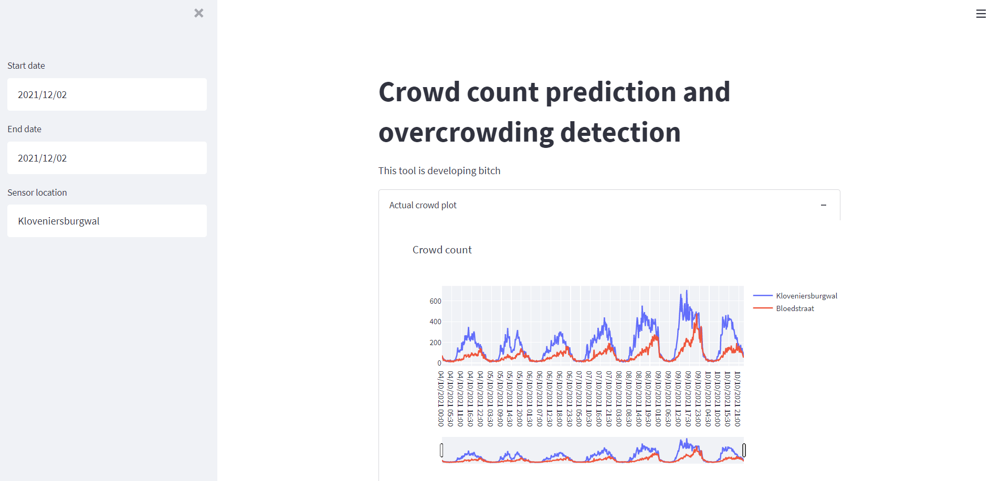

# Crowd count prediction and dashboard

This application predicts the 7-day crowdedness of 3 locations in the city centre of Amsterdam, to keep the citty safe. It gathers data from crowd-count sensors, weather stations, nearby (public) transport vendors and more, processes and cleans these to be used with LSTM and XGBoost models. This information along with valuable statistics is served to the user through an interactive dashboard.

>Our predictions were a 68% F1 accuracy improvement to the baseline due to improved models and data blending!\
>All crowd-count data has been replaced with dummy data for privacy reasons.

You can check the paper [here](/Crowd_Forecasting_based_on_Counting_Cameras_in_Amsterdams_Red_Light_District.pdf).



---

## Data Pipeline


---

## Deploying
<details>
<summary>Setting up the environment</summary>


### Python venv
Make sure `virtualenv` is installed on your machine. Then do these following steps: 

- ```virtualenv venv -p python3.7```

- ```source venv/bin/activate```

- ```pip install -r requirements.txt```

### conda venv
- ```conda create --name <envname> python=3.7```
- ```conda activate <envname>```
- ```pip install -r requirements.txt```
- Optionally, if you run on Mac, run the following:
```
brew install libomp
conda install -c conda-forge py-xgboost
```
</details>

Go to src directory, run this from the shell/terminal:

- ```streamlit run app.py```

You should see the app pop up.
