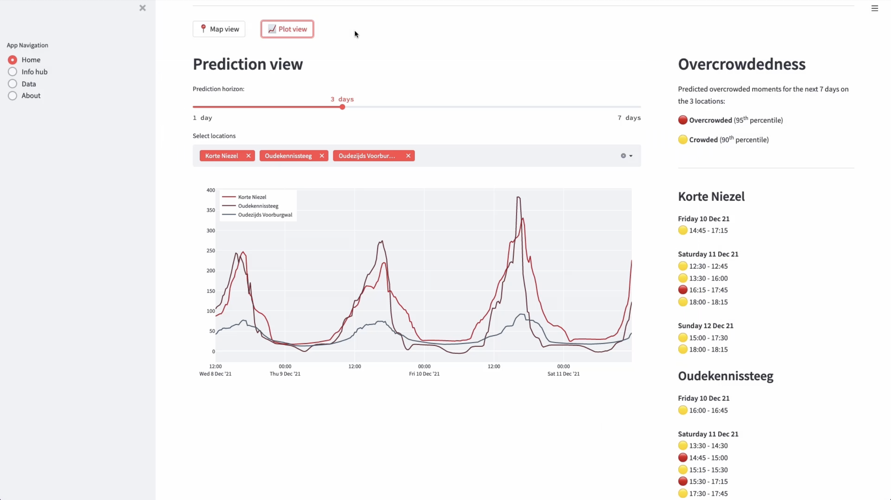

# Crowd count prediction and dashboard

## Development
Make sure `virtualenv` is installed on your machine. Then do these following steps: 

- ```virtualenv venv -p python3.7```

- ```source venv/bin/activate```

- ```pip install -r requirements.txt```

Go to src directory, run this from the shell/terminal:

- ```streamlit run app.py```

You should see this pop up.

